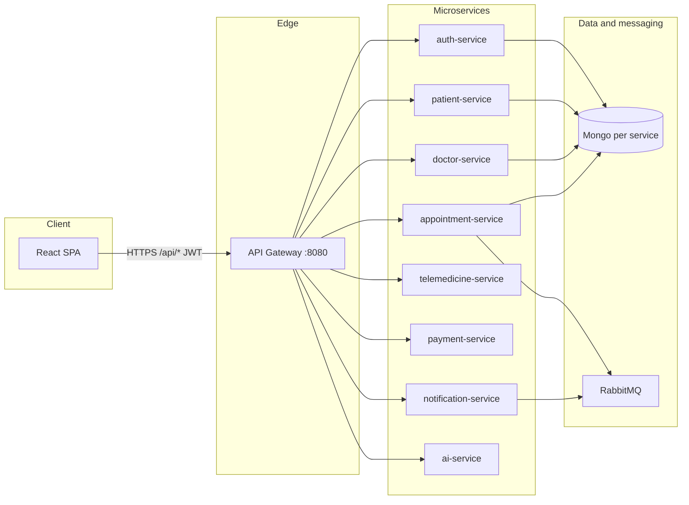

# Architecture overview

## High-level diagram

## Service interface list (summary)

| Service | Port (compose) | Responsibility |
|---------|----------------|----------------|
| api-gateway | 8080 | Routing, JWT verification, admin orchestration |
| auth-service | 4001 | Users, JWT issuance, doctor approval field |
| patient-service | 4002 | Patient profile, reports, prescriptions store |
| doctor-service | 4003 | Doctor profile, availability, verification status |
| appointment-service | 4004 | Booking, status, RabbitMQ events |
| telemedicine-service | 4005 | Jitsi / session URLs |
| payment-service | 4006 | Checkout records, status |
| notification-service | 4007 | Logs, email/SMS stubs, RabbitMQ consumer |
| ai-service | 4008 | Symptom checker |

See [GATEWAY_API.md](./GATEWAY_API.md) for HTTP paths the React app uses.
